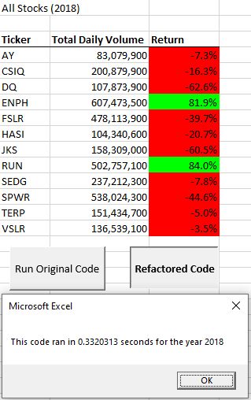
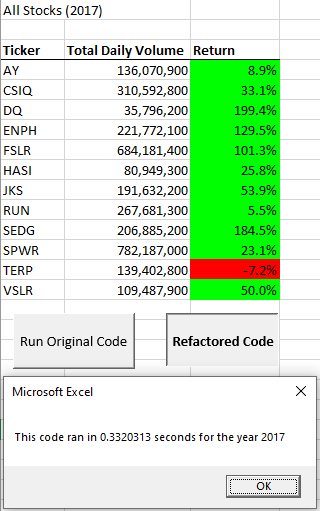

# VBA_Challenge
## Overview of the project
The project was an interesting analysis of stock prices using Visual Basic. I was provided with 2 years' worth of data to help Steve analyse green stocks for the year of 2018 and 2019. Through the course of the analysis I was able to learn different aspects of visual basics, conditional statements and loop statements which are widely used to automate repetitive tasks. The project also gave a fundemantal udnerstanding of macros and to coding using VBA.  

As part of the project and the module, the key was to be able to identify tickers and perform analysis on various tickers to ensure Steve was able to invest in the best possible stock for his parents.  

Key things learned
1. Different datatypes within VBA
2. Creating a variable and assigning dataypes to the variable
3. Conditional statements and for loops
4. Making VBA user-firendly by providing buttons and other visual ways for people to interact with the code without having to read them

## Analysis
### 2017 vs 2018 price analysis
2018 was a bad year overall for these stock tickers. **10 of the 12 stocks analysed had lost value and 3 of them had even lost over 40%**

Key points to note from 2018
1. ENPH and RUN were the only stocks which gained value and almost doubled in price
2. Both these stocks had high total daily volumes as well **_(over 500,000)_**
- However we must be careful as there is no general trend between total volume and return  

2017 on the other hand was a good year for these stocks. **11 out of the 12 stocks analysed had a positive return and 4 of these stocks more than doubled in price**

Key points to note from 2017
1. TERP was the only stock which lost value
2. DQ almost tripled in price and might not be the best investment at this point as it is overpriced  

**Takeaway from both years: These stocks are volatile and we should wait for stability before investing in any of these stocks. At a layman level this leads us to believe that 2018 was more a correction for these stocks and the future year prices might be a bit more stable compared to 2017 and 2018**

